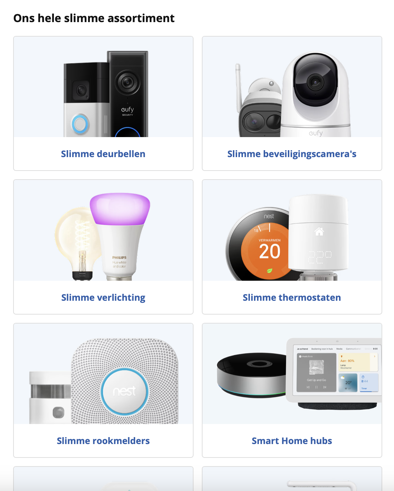

# Procesverslag
Markdown is een simpele manier om HTML te schrijven.  
Markdown cheat cheet: [Hulp bij het schrijven van Markdown](https://github.com/adam-p/markdown-here/wiki/Markdown-Cheatsheet).

Nb. De standaardstructuur en de spartaanse opmaak van de README.md zijn helemaal prima. Het gaat om de inhoud van je procesverslag. Besteedt de tijd voor pracht en praal aan je website.

Nb. Door *open* toe te voegen aan een *details* element kun je deze standaard open zetten. Fijn om dat steeds voor de relevante stuk(ken) te doen.

## Jij

  
uitwerken voor kick-off werkgroep

  ### Auteur:
 Joep Honnebier

  #### Je startniveau:
 Blauw

  #### Je focus:
Responsive
 

## Je website

  
uitwerken voor kick-off werkgroep

  ### Je opdracht:
  https://www.aceandtate.com/nl

  #### Screenshot(s) van de eerste pagina (small screen): 
  Pagina 1 - Homepagina
  

  #### Screenshot(s) van de tweede pagina (small screen):
  Pagina 2 - Oogmeting
  
 

## Toegankelijkheidstest 1/2 (week 1)

  ### Bevindingen
  Lijst met je bevindingen die in de test naar voren kwamen:
  - De officiele website zit vol met Div's
  - De "alt's" zijn aan verbetering toe
  - Geen h1 aanwezig

## Breakdownschets (week 1)

  
uitwerken na afloop 3e werkgroep

  ### de hele pagina's: 
  

 

## Voortgang 1 (week 2)

  
uitwerken voor 1e voortgang

  ### Stand van zaken
  Bij voortgangsgesprek 1 was ik enkel nog met de html bezig geweest, ik had op basis van mijn 
  breakdownschets de header, main en footer ingedeeld met sections en ik had net de afbeeldingen 
  en fonts gedownload met Image-downloader en Fonts-ninja.

  ### Agenda voor meeting
  samen met je groepje opstellen

  ### Verslag van meeting
  Na dit gesprek is mij duidelijk geworden dat ik nog even de Icons moet downloaden (dit kan ik doen
  met SVG-Gobbler) en dat ik op schema loop. Het is nu de bedoeling dat ik verder ga met de CSS en dat
  ik in mijn styles.css bestand roots kan gaan aanmaken. 

  - punt 1 - Beginnen aan mijn CSS
  - punt 2 - SVG-Gobbler toepassen
  - 

## Voortgang 2 (week 3)

  
uitwerken voor 2e voortgang

  ### Stand van zaken
 Bij voortgangsgesprek 2 (dit was voor andere gesprek 3 maar ik heb dit gesprek gemist wegens ziekte)
 was ik al een stuk verder gekomen met mijn Homepagina, ik had al een header, de main met 7 sections 
 en een footer. Deze ware allemaal responsive. 

  ### Agenda voor meeting
  samen met je groepje opstellen

  ### Verslag van meeting
Mijn header had ik eigenwijs opgebouwd met classes, dit gaan we direct aanpassen naar semantische html door
alle onderdelen met selectoren en ..-of-type vorm te geven. Ik had nog geen light-darkmode toegepast in mijn website.
En de Screenreader pakte mijn hamburgermenu mee wanneer deze niet zichtbaar was op desktop formaat. Mijn links (die op
de website eruit zien als buttons) zijn ook echt buttons, het is heel belangrijk om hier links van te maken anders is mijn 
website zeker niet semantisch. Mijn code mag overichtelijker met duidelijke notities als titels.

  - punt 1 - Website volledig zonder classes
  - punt 2 - Toepassen light/Dark-mode 
  - punt 3 - Hamburgermenu onzichtbaarmaken
    voor screenreader op telefoon formaat
  - punt 4 - Links niet als buttons coderen
  - punt 5 - Code overzichtelijker maken

## Toegankelijkheidstest 2/2 (week 4)

  ### Bevindingen

  Alle afbeeldingen zijn nu voorzien van een alt, er is een darkmode toepasbaar de volgorde van de elementen is op orde en de a's staan in list's 

## Voortgang 3 (week 4)

  
uitwerken voor 3e voortgang

  ### Verslag van meeting
  
De classes waren vervangen door aria-label... Dit is ook niet de bedoeling. 
Verwijder de aria-labels naar simpele html. 

De Darkmode was nog niet toegepast
op alle logo's en icons

De Script.css stond bovenaan inplaats van onderaan de html

De header en de footer horen in de gedeelde styles.css, zorg dat dit klopt

## Eindgesprek (week 5)

  
uitwerken voor eindgesprek

  ### Je uitkomst - karakteristiek screenshots:
  

  ### Dit ging goed/Heb ik geleerd: 
  Korte omschrijving met plaatjes

  

  ### Dit was lastig/Is niet gelukt:
  Korte omschrijving met plaatjes

  

## Bronnenlijst

  
continu bijhouden terwijl je werkt

1. Hulp bij het maken van eeen hamburgermenu Ik heb hier hulp gebruikt naast de oefeningen op DLO van een aantal Youtube tutorials: 
https://www.youtube.com/watch?v=0ik6X4DJKCc https://www.youtube.com/watch?v=y17RuWkWdn8 (Voor keydown) https://www.youtube.com/watch?v=rCqvTAKcWj4

2. Header show/hide, Ik heb hier hier hulp gebruikt een aantal Youtube tutorials: 
https://www.youtube.com/watch?v=_IRSvzxmRj8 & https://www.youtube.com/watch?v=Q_XZk5Vnujw

3. De Ace & Tate website had eerst geen video op de homepagina (hij is tussendoor geupdate)
Tijdens feedbackgesprek 2 hoorde ik dat ik dit nog kan toevoegen
hier hier hulp gebruikt een aantal Youtube tutorials: 
https://www.youtube.com/watch?v=yx-HYerClEA & https://www.youtube.com/watch?v=yY6XnbWnK4o

4. Voor het opbouwen van het formulier met oa de checkbox en input voor een emailadress 
   heb ik gebruikt gemaakt van tutorials als https://www.youtube.com/watch?v=fNcJuPIZ2WE & https://www.youtube.com/watch?v=frAGrGN00OA

5. De sliders heb ik opgebouwd met behulp van de volgende Tutorials:
https://www.youtube.com/watch?v=IESoUbWJF48 & https://www.youtube.com/watch?v=ytl6TrroGis

6. Voor snelle vragen wanneer ik ergens op vastliep gebruikte ik ChatGPT of of de Google AI zoekfunctie

7. Gebruik van grid, (oogmeting) Omdat de volgorde in deze drie sections op klein en groot formaat varieert heb ik hier grid gebruikt. Om dit goed te krijgen heb ik
naast de oefeningen op DLO gebruik gemaakt van de volgende tutorials: https://medium.com/@axel/mosaic-layouts-with-css-grid-d13f4e3ed2ae
https://www.youtube.com/watch?v=rg7Fvvl3taU, https://www.youtube.com/watch?v=0xMQfnTU6oo & https://www.youtube.com/watch?v=tFKrK4eAiUQ

8. Darkmode: https://www.youtube.com/watch?v=GUSUA72t7p0 & Uitleg tijdens feedback

